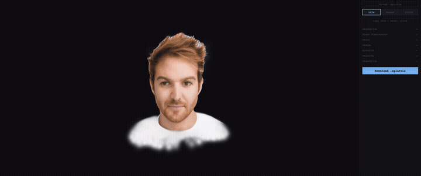

<div align="center">


# Splattie

**Interactive 3D avatars from a single photo.**

*Reacts to your cursor. Head responds to hover. Runs at 60fps in any browser.*

[](https://splattie.app)
[](LICENSE)
[](https://www.npmjs.com/package/@afromero/splattie-widget)
[](https://github.com/affromero/splattie/actions/workflows/ci.yml)
[](https://nextjs.org)
[](https://typescriptlang.org)
[](https://github.com/sparkjsdev/spark)
[](https://threejs.org)
[](https://python.org)
[](https://github.com/astral-sh/uv)

</div>

---

<p align="center">
  
</p>

Splattie turns a single photograph into an **interactive 3D Gaussian Splatting avatar** — a **head** or a **full body** — that lives on your website. Eyes follow the cursor, the face blinks naturally, the head and torso turn toward visitors (bodies add cursor-driven arm IK), hover and click trigger smooth state transitions. Rendered client-side. One file, one tag.

```html
<splattie-widget src="avatar.splattie"></splattie-widget>
<script src="https://unpkg.com/@afromero/splattie-widget"></script>
```

This repo contains the **landing page**, the **GPU generation pipeline**, and the **`.splattie` format spec**. The web component itself lives in a separate repo: [**affromero/splattie-widget**](https://github.com/affromero/splattie-widget) (published as [`@afromero/splattie-widget`](https://www.npmjs.com/package/@afromero/splattie-widget) on npm). If you only want to embed an avatar on your site, you don't need this repo.

## Why

Spark renders splats. SuperSplat edits them. StorySplat hosts them. **Nothing makes them react.** Splattie is the interaction layer - a portable `.splattie` bundle plus a web component that reads it.

## Try it

- **Hosted** - [splattie.app](https://splattie.app) - click any of the 16 demo avatars (8 heads + 8 bodies), play with the sliders, download the customised `.splattie`.
- **Embed the widget** - `npm install @afromero/splattie-widget` and drop the tag on your page. The 16 demo `.splattie` files in [`apps/web/public/demos/`](apps/web/public/demos) are **AI-generated (synthetic)** — no real people, no attribution required.
- **Self-host** with your own GPU - see below.

## Run it locally

### Frontend only (no GPU, 1 minute)

```bash
git clone https://github.com/affromero/splattie.git
cd splattie
git submodule update --init
npm install
npm run dev
```

Open [http://localhost:4001](http://localhost:4001). All 16 demo avatars (heads + bodies) work, the state editor works, downloads work. No backend needed.

### Self-host the full app (with GPU)

The hosted [splattie.app](https://splattie.app) doesn't expose the upload flow - that needs a GPU. If you have one, set `NEXT_PUBLIC_SELF_HOST=true` and the **Create** route lights up:

```bash
cp .env.example .env.local
# edit .env.local:
#   NEXT_PUBLIC_SELF_HOST=true
#   NEXT_PUBLIC_API_URL=http://localhost:8000

# install GPU deps (CUDA 12.x, ~20 min — downloads LAM head + LHM body weights)
cd backend
bash scripts/setup-gpu.sh

# run the backend
uv run uvicorn splattie.api.app:create_app --factory --reload --port 8000

# in another shell, run the frontend
cd ../
npm run dev
```

Now [http://localhost:4001/create](http://localhost:4001/create) accepts photos and generates a 3D **head** (LAM) or **body** (LHM) in ~20-30 s on an H100, then routes you to the state editor where you can tune the interactions and download the `.splattie`. No CLI required.

### Widget development

```bash
cd packages/splattie-widget
npm run dev
```

Open [http://localhost:4002](http://localhost:4002). Hot-reload for the widget itself, sliders for all five state dimensions, drag-drop any `.splattie` to load it.

## The `.splattie` format

A ZIP bundle with a required `manifest.json` declaring every asset and locking the format version to the widget version. Full spec: [FORMAT.md in the widget repo](https://github.com/affromero/splattie-widget/blob/main/FORMAT.md).

```
avatar.splattie
├── manifest.json             # required - declares assets + assetType (head/body) + formatVersion
├── *.ply or *.spz            # required - Gaussian splats
│
│  # head (assetType: head) — FLAME rig:
├── bone_tree.json            # optional - skeleton (FLAME 5 bones)
├── lbs_weight_20k.json       # optional - per-splat skinning weights
├── expression_basis.bin      # optional - FLAME PCA blendshape basis
│
│  # body (assetType: body) — SMPL-X rig:
├── skeleton.json             # optional - skeleton (SMPL-X 55 joints, baked-pose rest)
├── lbs_weights.json          # optional - per-gaussian sparse LBS weights
│
└── states.json               # optional - idle/hover/click definitions
```

Each state defines all five interaction dimensions: **ghost** (floating motion), **expression** (FLAME blendshapes + bones for heads), **camera** (spherical position), **rotation** (object pitch/yaw/roll), **tracking** (cursor-follow intensity per bone — head/eyes for heads, head/torso for bodies). Bodies are skinned with SMPL-X linear blend skinning and add two-bone arm IK; heads use FLAME SplatSkinning. The format is the same bundle either way — the widget branches on `assetType`.

## Architecture

```
splattie/
├── apps/web/                       # Next.js 15 landing + editor (port 4001)
│   └── src/app/                    # /, /create, /view/[id]
├── packages/splattie-widget/       # <splattie-widget> web component (MIT)
│   ├── src/                        # SplatWidget, StateMachine, dimensions (look-at, IK)
│   └── FORMAT.md                   # .splattie format spec
├── backend/                        # FastAPI GPU service (port 8000)
│   ├── src/splattie/methods/lam/   # LAM head generation (FLAME)
│   ├── src/splattie/methods/lhm/   # LHM body generation (SMPL-X)
│   ├── scripts/setup-gpu.sh        # CUDA + LAM/LHM weights setup
│   ├── scripts/generate_splattie_batch.py  # CLI batch generation (head/body)
│   ├── vendor/LAM/                 # LAM submodule (SIGGRAPH 2025)
│   └── vendor/LHM/                 # LHM submodule (SIGGRAPH 2025)
├── Dockerfile.backend              # GPU image
├── apps/web/Dockerfile             # Web image (port 4001)
└── deploy/Caddyfile                # Reverse proxy fragment for splattie.app
```

| Component | Technology |
|-----------|-----------|
| Frontend | Next.js 15, TypeScript strict, CSS Modules |
| Rendering | Spark 2.0 (World Labs, MIT) + Three.js |
| Animation (heads) | FLAME SplatSkinning (dual quaternion) + PCA blendshapes |
| Animation (bodies) | SMPL-X linear blend skinning + head/torso look-at + two-bone arm IK |
| Backend | FastAPI, Python 3.10, uv |
| Asset generation | LAM (heads, FLAME) + LHM (bodies, SMPL-X) — both SIGGRAPH 2025; swappable via the `AssetGenerationMethod` protocol (`asset_type`: head/body/object) |
| Format | ZIP with `manifest.json`, version-locked to the widget |

## API

The widget exposes a simple custom-element API:

```html
<splattie-widget
  src="avatar.splattie"
  background="#0e0e14"
  width="100%"
  height="400px"
></splattie-widget>
```

```javascript
widget.addEventListener('splatload',  () => {});
widget.addEventListener('splathover', () => {});
widget.addEventListener('splatclick', () => {});
widget.setState('hover');
```

React wrapper available via `@afromero/splattie-widget/react`. Full reference in the [widget README](https://github.com/affromero/splattie-widget#readme).

## Contributing

See [`CONTRIBUTING.md`](CONTRIBUTING.md).

## Acknowledgements

Splattie builds on outstanding open-source research:

- **[LAM](https://github.com/aigc3d/LAM)** (SIGGRAPH 2025) - Large Avatar Model for single-image 3DGS **head** generation. By Zixuan Zeng et al., AIGC3D.
- **[LHM](https://github.com/aigc3d/LHM)** (SIGGRAPH 2025) - Large Animatable Human Model for single-image 3DGS **body** generation. By AIGC3D.
- **[FLAME](https://flame.is.tue.mpg.de/)** - 3D face shape, expression, and pose model (heads). By Tianye Li, Timo Bolkart, Michael J. Black, Hao Li, Javier Romero.
- **[SMPL-X](https://smpl-x.is.tue.mpg.de/)** - Expressive 3D body model (bodies). By Pavlakos, Choutas, Ghorbani, Bolkart, Osman, Tzionas, Black (MPI).
- **[Spark 2.0](https://github.com/sparkjsdev/spark)** - MIT-licensed 3DGS renderer for Three.js, by World Labs.
- **[3D Gaussian Splatting](https://repo-sam.inria.fr/fungraph/3d-gaussian-splatting/)** - Real-time radiance field rendering. Kerbl, Kopanas, Leimkühler, Drettakis (INRIA).
- Demo avatars are **AI-generated (synthetic)** — they are not real people.

## License

The Splattie source code is **MIT-licensed** and commercial-use safe:

- the `<splattie-widget>` web component (`@afromero/splattie-widget` on npm)
- the `.splattie` format and `manifest.json` schema
- the web app (`apps/web/`)

The reference GPU pipeline (`backend/`) wraps **LAM** (Apache 2.0) + **LHM** (Apache 2.0) + **gsplat** (Apache 2.0) on top of parametric models — **FLAME** (heads) and **SMPL-X** (bodies). The non-commercial pieces are those two face/body models; everything else is Apache 2.0 / MIT. The widget itself does not require any of this at runtime - it only needs a valid `.splattie` file.

**Three paths to commercial use** (see [`NOTICE`](NOTICE) for the full breakdown):

1. **Widget-only** - use the widget freely; generate `.splattie` files through your own pipeline.
2. **License FLAME / SMPL-X** - contact [MPI for Intelligent Systems](https://www.is.mpg.de) for commercial FLAME (heads) and SMPL-X (bodies) terms. The rest of the stack is already Apache 2.0 / MIT.
3. **Drop-in replacement** - implement an alternative asset-generation method behind the `AssetGenerationMethod` protocol in [`backend/src/splattie/methods/`](backend/src/splattie/methods/), declaring its `asset_type` (head/body/object). The format is method-agnostic.
